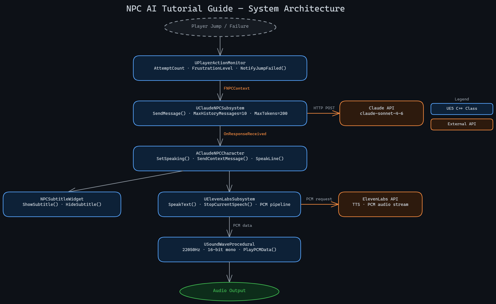

# Claude-Powered NPC Tutorial Guide (UE5)

A tutorial NPC that reads what the player is doing in real time, decides what to say, and speaks it in voice. No scripted dialogue trees. No branching conversation nodes. The character, AXIOM, is driven by the Claude API, state-aware of the player at all times, and voiced through ElevenLabs.

Built in Unreal Engine 5.7.4.

> **Video demo:** https://www.linkedin.com/posts/tylermunstock_unrealengine-claudeapi-elevenlabs-activity-7455304555379970048-U1W9/

---

## What This Is

Most game tutorials are pre-written. The guide NPC says the same lines every run regardless of what the player is actually doing. This project replaces that with a live LLM agent that:

- Watches player actions via `UPlayerActionMonitor`, recording launch velocity at takeoff and classifying failures by cause (too early, no run-up, walked off edge)
- Assembles a structured context snapshot (`FNPCContext`) on every trigger event: failures, successes, and frustration escalation tied to attempt count
- Calls the Claude API (`claude-sonnet-4-6`) with sliding-window conversation memory, 10 messages max (5 exchanges)
- Renders the response text immediately to a screen-space subtitle widget
- Sends the same text to ElevenLabs (`eleven_turbo_v2_5`) for voice synthesis, streamed as raw PCM into `USoundWaveProcedural`, no disk I/O
- Blocks NPC movement while speaking via a pending-request pattern, so AXIOM never walks mid-sentence

The NPC feels like another player coaching you, not a script firing.

---

## The NPC: AXIOM

AXIOM's persona is an ancient, gravelly elder, wise and venomous, with centuries of exhausted patience. Frustration level (0 to 10 in `FNPCContext`) escalates the tone automatically:

| Frustration | Tone |
|---|---|
| 0 to 2 | Patient, encouraging |
| 3 to 5 | Sarcastic |
| 6 to 8 | Frustrated |
| 9 to 10 | Full elder meltdown |

At every level, AXIOM delivers the real coaching tip. The escalation is personality, not noise.

---

## Stack

| Layer | Technology |
|---|---|
| Engine | Unreal Engine 5.7.4 |
| Language | C++ (core systems) + Blueprint (level integration) |
| LLM | Claude API, claude-sonnet-4-6 |
| TTS | ElevenLabs, eleven_turbo_v2_5 |
| Base template | Epic Third Person C++ + Variant_Platforming |
| Memory | Sliding-window conversation history (10 messages) |

---

## Architecture



```
UClaudeNPCSubsystem          (GameInstanceSubsystem)
  SendMessage(FNPCContext)   async HTTP POST to Claude API
  ConversationHistory        TArray<FNPCMessage>, capped at MaxHistoryMessages
  CurrentRequestId           stale-response guard, incremented per call
  OnResponseReceived         multicast delegate → AClaudeNPCCharacter

UElevenLabsSubsystem         (GameInstanceSubsystem)
  SpeakText(FString)         async HTTP POST to ElevenLabs
  StopCurrentSpeech()        halts playback, clears subtitle state
  PCM pipeline               22050 Hz, 16-bit mono → USoundWaveProcedural
  SpeechCompletedTimer       duration from PCM byte count (OnAudioFinished
                             not reliable for procedural waves in UE5)
  OnSpeechCompleted          fires when the voice line ends naturally

AClaudeNPCCharacter          (ACharacter)
  State machine              Idle / Demonstrating / Watching / Following
  bIsSpeaking                parallel speaking flag, never blocks movement states
  StartDemonstration()       sequences FNPCWaypoint array, handles scripted jumps
  MoveToPosition()           NavMesh repositioning between obstacles
  Pending-request pattern    both methods defer when bIsSpeaking, execute on
                             OnSpeechFinished; Demonstration takes priority

UPlayerActionMonitor         (UActorComponent on player character)
  OnOwnerMovementModeChanged records launch velocity at takeoff
  NotifyJumpFailed()         classifies failure, sends FNPCContext to subsystem
  NotifyJumpSuccess()        sends success context, resets attempt state
  ComputeFrustrationLevel()  maps AttemptCount → 0 to 10 frustration scale

UTutorialStageManager        (UActorComponent on BP_TutorialManager)
  Stages                     TArray<FTutorialStage> configured in Blueprint
  PlayLevelIntro()           fires AXIOM intro line, defers StartTutorial until done
  CompleteCurrentStage()     fires success line, advances after voice finishes
  AdvanceToNextStage()       resets history + attempt count, activates next stage
  PlayLevelOutro()           performance-aware closing line, broadcasts OnTutorialComplete
  RespawnPlayerAtCheckpoint() teleports player to per-stage checkpoint on failure
```

### Coaching Event Flow

1. Player leaves the ground, `UPlayerActionMonitor` records launch velocity via `MovementModeChangedDelegate`
2. Player lands or falls. `NotifyJumpFailed()` or `NotifyJumpSuccess()` fires from a Blueprint trigger
3. `UPlayerActionMonitor` classifies the failure reason (`DetermineFailureReason()`) and builds `FNPCContext`: challenge name, attempt count, last failure reason, frustration level
4. Context is passed to `UClaudeNPCSubsystem::SendMessage()`, which POSTs to Claude with the AXIOM persona prompt and trimmed conversation history
5. Response arrives on the game thread via `OnResponseReceived` delegate
6. `AClaudeNPCCharacter` shows the text in the subtitle widget immediately, then calls `UElevenLabsSubsystem::SpeakText()`
7. PCM audio is received, fed into `USoundWaveProcedural`, and played. `bIsSpeaking` flips true
8. A timer calculated from PCM byte count fires `OnSpeechCompleted` when audio ends. `bIsSpeaking` flips false, any pending movement executes

---

## Why This Is Interesting

**Context-aware, not timer-aware.** AXIOM reacts to what the player actually did on that attempt, not a schedule. The same failure on attempt 1 and attempt 7 gets a different response because `FrustrationLevel` is injected into the system prompt, not tracked by the model.

**Pending-request pattern.** The single biggest UX regression during development was the NPC walking mid-sentence because a stage trigger fired while audio was playing. The fix: `StartDemonstration()` and `MoveToPosition()` check `bIsSpeaking` on entry, store their arguments (`bHasPendingDemonstration`, `PendingMoveTarget`, etc.), and execute on `OnSpeechFinished()`. One flag, material feel difference.

**Stale-response guard.** Both subsystems maintain a `CurrentRequestId` counter. Each async HTTP call captures the ID at dispatch. Responses whose captured ID no longer matches the current counter are discarded, so a slow coaching response never interrupts a success line that was requested after it.

**Scripted jumps over NavMesh.** `FNPCWaypoint` supports `bIsJumpLaunchPoint = true`, which stops NavMesh pathfinding at the launch point and fires `CalcJumpLaunchVelocity()`, a projectile motion calculation (`ΔPos / t − 0.5 * g * t` per axis). The NPC lands and resumes normal waypoint sequencing from `Landed()`. NavMesh cannot jump across gaps; scripted arcs give predictable, repeatable demo quality.

**PCM duration timer.** `UAudioComponent::OnAudioFinished` does not fire reliably for `USoundWaveProcedural` in UE5. `UElevenLabsSubsystem` calculates playback duration from byte count (`bytes / (sampleRate * channels * bytesPerSample)`) and uses a `FTimerHandle` instead. The timer is cleared by `StopCurrentSpeech()` so cancelled lines do not fire `OnSpeechCompleted`.

---

## Project Structure

```
Source/NPC_AI_Guide/AI/
  NPCTypes.h                    FNPCContext, FNPCMessage, FNPCWaypoint,
                                FTutorialStage, ENPCState, delegate types
  ClaudeNPCSubsystem.h/.cpp     Claude API client, sliding-window history
  ElevenLabsSubsystem.h/.cpp    ElevenLabs TTS client, PCM audio pipeline
  ClaudeNPCCharacter.h/.cpp     AXIOM character, state machine, waypoint sequencer
  ClaudeNPCAIController.h/.cpp  Thin AAIController, OnNPCMoveCompleted delegate
  PlayerActionMonitor.h/.cpp    Jump event monitor, failure classifier, context builder
  NPCSubtitleWidget.h/.cpp      Typewriter subtitle base (C++), implemented in Blueprint
  TutorialStageManager.h/.cpp   Stage lifecycle, checkpoint/respawn, voice sequencing
```

---

## Setup

### Requirements

- Windows 10 or 11
- Visual Studio 2022 (v17.8 or later) with the **Game Development with C++** workload
- Unreal Engine 5.7.4
- A Claude API key (Anthropic console)
- An ElevenLabs API key and Voice ID

### Install

1. Clone the repository

2. Copy the secrets template:
   ```
   NPC_AI_Guide/Config/Secrets.example.ini → NPC_AI_Guide/Config/Secrets.ini
   ```
   `Secrets.ini` is gitignored. Do not commit your keys.

3. Open `NPC_AI_Guide/Config/Secrets.ini` and fill in your credentials:
   ```ini
   [NPCGuide.APIKeys]
   ClaudeAPIKey=sk-ant-...
   ElevenLabsAPIKey=...
   ElevenLabsVoiceId=...
   ```

4. Right-click `NPC_AI_Guide/NPC_AI_Guide.uproject` → **Generate Visual Studio Project Files**

5. Open the generated `NPC_AI_Guide/NPC_AI_Guide.sln`, set the solution configuration to **Development Editor | Win64**, and build

6. Open the project in Unreal Editor

7. Open `Lvl_ThirdPerson` and press **Play** (PIE)

### AXIOM will not speak if

- `Secrets.ini` is missing or keys are blank (check the Output Log for `[ClaudeNPCSubsystem]` errors)
- No audio output device is available (ElevenLabs returns audio but UE5 has nowhere to play it)
- The NavMesh is not built over the starting platform (NPC will not move to its start position)

---

## Known Limitations

- **Latency.** Claude round-trip plus ElevenLabs synthesis is typically 3 to 6 seconds per line. There is no streaming audio. First-word latency requires a streaming TTS upgrade to close.
- **Cost per session.** Every coaching line is a live API call. A full playthrough is real money. Caching repeat-failure responses is a follow-up.
- **English only.** Both APIs support additional languages, but the AXIOM prompt and voice selection are tuned for English.
- **Single NPC.** The architecture supports multiple instances, but the level is designed around one coach character.
- **No persistence across sessions.** Conversation history clears on exit. AXIOM does not remember previous runs.

---

## What I Learned

- **Frustration escalation belongs in the context, not the model.** Injecting `FrustrationLevel` as a numeric field in `FNPCContext` and mapping it to tone in the system prompt is more reliable and cheaper than trying to have the model track emotional state across a conversation window.
- **Movement during speech was the hardest UX bug and the simplest fix.** The pending-request pattern is about 30 lines of code. The feel difference to the player is substantial.
- **`OnAudioFinished` is not reliable for procedural waves in UE5.** Calculating playback duration from PCM byte count and driving completion via a timer handle is the correct approach.
- **Stale responses need an explicit guard.** Without `CurrentRequestId`, a slow failure-coaching response from attempt 3 can arrive after the success line from attempt 4 has already fired, interrupting the congratulation mid-word.
- **Scripted waypoint jumps beat NavMesh for demo quality.** NavMesh pathfinding cannot traverse gaps. Scripted projectile arcs via `CalcJumpLaunchVelocity()` give the NPC a predictable, clean demonstration every time, which is exactly what a tutorial coach needs.

---

## Credits

Built by Tyler Munstock. Part of the AI career pivot portfolio at [tymai.dev](https://tymai.dev).

Architecture reference: Fortnite's Darth Vader AI integration (Google Gemini 2.0 Flash + ElevenLabs, May 2025).

---

## License

MIT License. See `LICENSE` for details.
